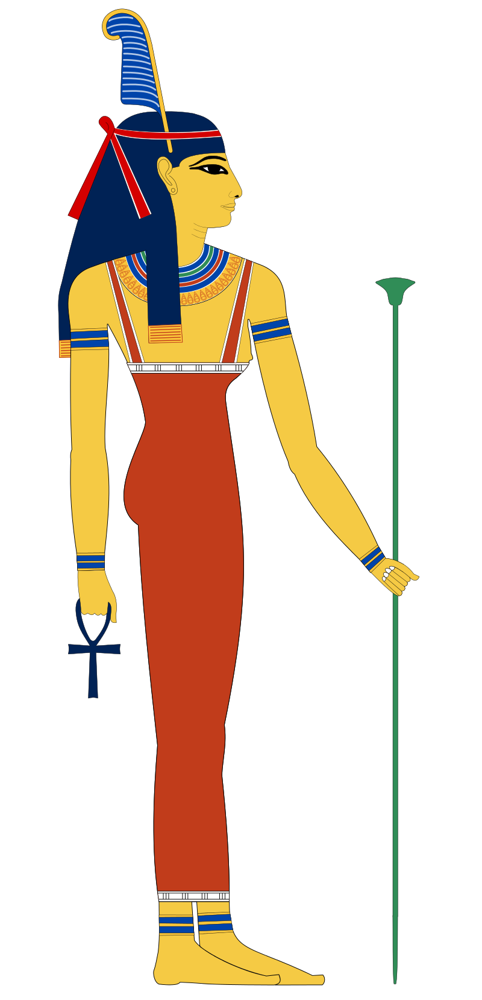
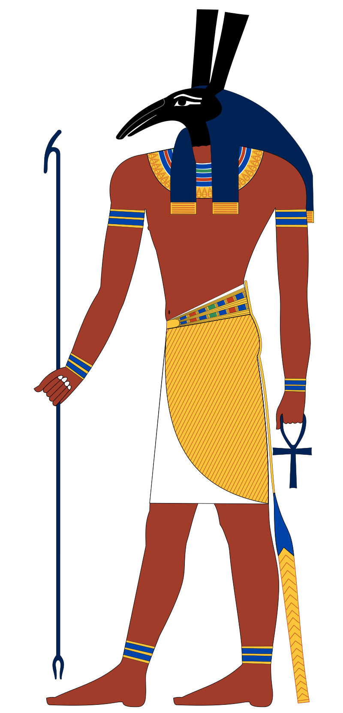

## the power of order

order is the soil from which all good things grow 🌱 it cultivates a controlled environment in which peace + focus can flourish 💐 order shifts the entropic state of a system further away from chaos + randomness, allowing one the golden opportunity to reclaim the reigns of destiny + bend life at their will 🌬 in an ordered system, all individual pieces are fully accounted for where the composition as a whole can be seen from above, revealing the relations connecting all of its components 🐝 order is a magical state of being that allows one to harness intention...

## ma'at, goddess of order

  

    
  

  

    
long ago, in ancient egypt, no deity was more highly revered by the people + pharaohs than <b>ma'at</b>, <i>goddess of order</i> ✨ it was her who awaited them all at the end of the 42 gates to heaven where her fairness would grant them access to the after-life so long as their sin-filled hearts didn't outweigh an ostrich's feather 🪶 she was the personification of truth + justice, a role model of all the principles that mothers would teach their children to embody in order to foster a morally-rich civilization that can earn their right to live eternally 💫 it was this <i>godess of order</i> that maintained the harmon y of the rising sun god ra [god of order] from the rising from the horizon from nun, the chaotic body of water from which ra rises ~ she was the restorer of balance in the fight of chaos [isfret] 

  

 
 

## the life changing magic of ...

  

    
<b>tidying up</b>, <i>as defined by <b>chatgpt</b> is</i>  
    <mark style="background-color: red; color: black; padding: 0px; border-radius: 0px;">the act of organizing + cleaning a space to make it neat, orderly, and free from clutter ~ this process typically involves arranging items in their designated places, getting rid of unnecessary items, and generally creating a more visually appealing and functional environment ~ tidying up can be applied to various settings, such as homes, offices, or any other spaces where organization and cleanliness are desired ~ it contributes to a sense of order, promotes efficiency, and can have positive effects on mental well-being ~</mark>

  

  

    
  

  

    
<b>tidying up</b>, <i>as defined by <b>chatgpt</b> is</i>  
    <mark style="background-color: red; color: black; padding: 0px; border-radius: 0px;">the act of organizing + cleaning a space to make it neat, orderly, and free from clutter ~ this process typically involves arranging items in their designated places, getting rid of unnecessary items, and generally creating a more visually appealing and functional environment ~ tidying up can be applied to various settings, such as homes, offices, or any other spaces where organization and cleanliness are desired ~ it contributes to a sense of order, promotes efficiency, and can have positive effects on mental well-being ~</mark>

  

  

    
  

## enter anytype

<!--
verbatim:
<mark style="background-color: red; color: black; padding: 0px; border-radius: 0px;">the act of organizing + cleaning a space to make it neat, orderly, and free from clutter. This process typically involves arranging items in their designated places, getting rid of unnecessary items, and generally creating a more visually appealing and functional environment. Tidying up can be applied to various settings, such as homes, offices, or any other spaces where organization and cleanliness are desired. It contributes to a sense of order, promotes efficiency, and can have positive effects on mental well-being.</mark>

to organize or put things in their place, in order ~

## set, god of chaos

  

    
Set (/sɛt/; Egyptological: Sutekh - swtẖ ~ stẖ[a] or Greek: Seth /sɛθ/) is a god of deserts, storms, disorder, violence, and foreigners 

  

  

    
  

all those who have departed the earthly realm, where through truth + justice,

<i>goddess of truth, balance, and <b>order</b></i>

> **order** ~  
> ~ organization via systematic arrangement of items in relation to one another  
~ grouping items based on a particular sequence, pattern, or attributes  
~ shifts a system's entropic state further from chaos and randomness  


*order* ~  
~ organization via systematic arrangement of items in relation to one another  
~ grouping items based on a particular sequence, pattern, or attributes  
~ shifts a system's entropic state further from chaos + randomness  



*order* ~  
~ organization via systematic arrangement of items in relation to one another  
~ grouping items based on a particular sequence, pattern, or attributes  
~ shifts a system's entropic state further from chaos + randomness  


## ma'at

Ma'at was the goddess who personified the concepts of truth, justice, harmony, law, morality, balance, and most importantly - order. In paintings, she was depicted as a woman who is either sitting or standing with an ostrich feather on her head and, in some cases, she was depicted with wings

   

the following is my [review](https://www.producthunt.com/products/anytype/reviews) left on producthunt the day of their public launch


"the legos of all personal knowledge management systems 🧠 it unifies the utility of notion w/ the heroic principles of obsidian to provide an ultra granular/customizable interface that allows you organize/systemize just about any type of data you can throw at it 🗂 while notion excels at creating/managing databases + obsidian shines at seamlessly composing + linking documentations, anytype is the perfect union of the two w/ its space~wide parameter system 🧱 every unit of information is an object, every object has a type, and relations define + link objects 🏗 the power of modularity this basic system provides is what truly makes anytype the legos of all pkm's/second~brain apps 👑 at the core of its superpowers are its superhero principles ~ local first, peer2peer, encrypted, open~sourced, and free [limitless functionality] 💎 anytype has become the focal point of my entire [productivity] system + it is impossible to overstate how much i admire/adore the product the fine folks behind anytype have created 🙏🏽 thank you, anytype team ✨"



-->

<!-- research
info maat 1 ~
Maat or Maʽat (Egyptian: mꜣꜥt /ˈmuʀʕat/, Coptic: ⲙⲉⲓ)[1] comprised the ancient Egyptian concepts of truth, balance, order, harmony, law, morality, and justice. Ma'at was also the goddess who personified these concepts, and regulated the stars, seasons, and the actions of mortals and the deities who had brought order from chaos at the moment of creation. Her ideological opposite was Isfet (Egyptian jzft), meaning injustice, chaos, violence or to do evil.

live on Maat

To the Egyptian mind, Maat bound all things together in an indestructible unity: the universe, the natural world, the state, and the individual were all seen as parts of the wider order generated by Maat.

When rhetors are attempting to achieve balance in their arguments, they are practicing Maat.

info maat 2 ~
Ma’at was the goddess of truth, justice, balance, and most importantly - order. In paintings, she was depicted as a woman who is either sitting or standing with an ostrich feather on her head and, in some cases, she was depicted with wings. According to the creation myths, Ma’at was created when Ra arose from the waters of Nun (chaos). Ma’at was often considered to be the daughter of Ra and was married to Thoth, god of wisdom.

However, Ma’at was more than just a goddess to the ancient Egyptians. She represented the crucial concept of how the universe was maintained. The ancient Egyptians believed the universe had an order to it, and it was Ma’at who kept everything in balance

info maat 3 ~
To the ancient Egyptians, she was not just a goddess, but a power that ensured balance and peace in all realms – human, divine, and natural.

Apart from law and religion, Maat’s beliefs reached personal behavior too. Egyptians believed that following Maat’s principles would bring blessings and going against them would cause chaos and bad luck. Therefore, people were supposed to act with honesty, integrity, and respect for others.

One exciting part of Maat is her bond to nature. The Egyptians saw how the sun rose and set each day, taking note of its dependable pattern that followed the laws of nature. They related this cycle to Maat’s perpetual presence, strengthening her importance in sustaining global balance.

info set 1 ~
Set (/sɛt/; Egyptological: Sutekh - swtẖ ~ stẖ[a] or Greek: Seth /sɛθ/) is a god of deserts, storms, disorder, violence, and foreigners in ancient Egyptian religion.[6]: 269  In Ancient Greek, the god's name is given as Sēth (Σήθ). Set had a positive role where he accompanies Ra on his barque to repel Apep, the serpent of Chaos.

info set 2 ~
Set was Ma'at's great antagonist - the agent of chaos, disorder and confusion who threatened the stability and righteousness represented by the goddess of truth and justice. He was her mythological opposite.

chaos and disruption to order were attributed to the god Set's actions and influence in ancient Egyptian theology. He deliberately confounds order to cause isfet.
Isfet simply means the state of chaos, disorder, injustice, violence or moral corruption in ancient Egyptian. It is the condition produced when ma'at is undermined.
Ma'at itself is the central concept referring to the proper order of the universe, justice, truth and harmony in ancient Egypt.
So Ma'at is the abstract ideal of universal harmony and righteous order. When Set works to undermine that order, it produces conditions of isfet - disorder and injustice.
This mirrors the interplay between deities like Osiris (order) and Set (chaos). But while Set is an anthropomorphic god and active agent, isfet is more of a state of affairs or situation, not an entity itself.
So in essence:
Ma'at = order/truth/justice
Set = god of chaos and disorder
Isfet = condition of chaos Set creates
The key is that Set directly causes isfet through his actions. Isfet refers to the chaos itself, while Set is the deity personifying disruption and chaos.
-->

<!--
unused assets ~

-->

<!--
scrapped passages

~ provides a comprehensive overview, attains clarity in understanding, adds efficiency to processes, and increases predictability of outcomes

the arrangement or disposition of people or things in relation to each other according to a particular sequence, pattern, or method.

Organization or System: Order can describe a state of organization or a systematic arrangement, often implying a lack of chaos or randomness.


order ~  
~ organization via systematic arrangement of items in relation to one another  
~ grouping items based on a particular sequence, pattern, or attributes  
~ shifts a system's entropic state further from chaos and randomness  


-->

<!--
fix/troubleshoot ~

  

  

  

  

  

    
<b>tidying up</b>, <i>as defined by <b>chatgpt</b> is</i>  
    <mark style="background-color: red; color: black; padding: 0px; border-radius: 0px;">the act of organizing + cleaning a space to make it neat, orderly, and free from clutter ~ this process typically involves arranging items in their designated places, getting rid of unnecessary items, and generally creating a more visually appealing and functional environment ~ tidying up can be applied to various settings, such as homes, offices, or any other spaces where organization and cleanliness are desired ~ it contributes to a sense of order, promotes efficiency, and can have positive effects on mental well-being ~</mark>

  

  

    
  

~ ~ ~ ~ to fix non dynamic verticle stack in mobile + desktop ~ ~ ~ ~

A couple things to try:
Make sure the media query CSS is actually being applied properly in the rendered markdown. You can check by inspecting the elements in dev tools.
Try using a larger min-width in the media query, like 992px:

Copy code
@media (min-width: 992px) {

  #left2, #right2 {
    width: 48%;
  }

}
Confirm the parent #kondo container is displayed as flex:

Copy code
#kondo {
  display: flex;
  flex-wrap: wrap;
}
Try applying widths without media queries first:

Copy code
#left2 {
  width: 48%;
}

#right2 {
  width: 48%;
}
Some markdown parsers may handle media queries differently. Let's narrow down where it's falling apart.
Let me know if any of those tests change the behavior!

-->
