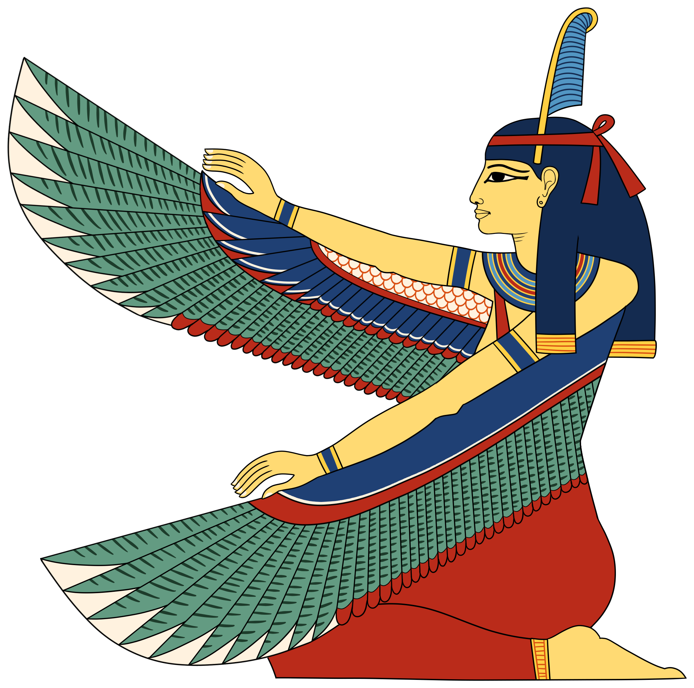

## the power of order

order is the soil from which all good things grow 🌱 it cultivates a controlled environment in which peace + focus can flourish 💐 order shifts the entropic state of a system away from chaos + randomness, granting one the opportunity to reclaim the reigns of their destiny so they may manifest their wishes + desires ✨ in an ordered system, all individual pieces are fully accounted for where the composition, as a whole, can be seen from above, revealing the relations connecting all of its components ~

## ma'at, goddess of order

  

    
  

  

    
long ago, in <b><i>ancient egypt</i></b>, no deity was more highly revered by the people + pharaohs than <b><i>ma'at</i></b>, <i>goddess of order</i> ✨ it was her who awaited them all at the end of the 42 gates of heaven where it was her fairness that would grant them access to the after-life ☥ she was the personification of truth + justice, a role model embodying all the principles that mothers would try to instill in their children ~ <b><i>ma’at</i></b> was created when <b><i>ra</i></b>, <i>sun-god</i>, arose from the waters of <b><i>nun</i></b> [chaos] ~ it was <b><i>maat</i></b> that then perpetuted the the harmoney that maintained the perpetual harmony ~ she was the restorer of balance in the fight of chaos [isfret] 

  

  

    <blockquote>
    to the <b><i>egyptian</i></b> mind, <b><i>maat</i></b> bound all things together in an indestructible unity: the universe, the natural world, the state, and the individual were all seen as parts of the wider order generated by <b><i>maat</i></b>
    </blockquote>
    ~ <a href="https://en.wikipedia.org/wiki/Maat" target="_blank">wikipedia </a>

  

## the life changing magic of ...

    

        
<b>tidying up</b>, <i>as defined by <b>chatgpt</b> is</i>  
        <mark style="background-color: red; color: black; padding: 0px; border-radius: 0px;">the act of organizing + cleaning a space to make it neat, orderly, and free from clutter ~ this process typically involves arranging items in their designated places, getting rid of unnecessary items, and generally creating a more visually appealing and functional environment ~ tidying up can be applied to various settings, such as homes, offices, or any other spaces where organization and cleanliness are desired ~ it contributes to a sense of order, promotes efficiency, and can have positive effects on mental well-being</mark>

    

  

    
  

  

    
if you've never read the book, you may find its title to be overly audacitic in its claim that simply <i>organizing</i> can lead to <i>life-changing magic</i> 🪄 if you have read the book, however, then you've likely repeatedly felt a sense of that magic vicariously w/out ever tidying up a space 🛋 <b><i>kondo's</i></b> mere descriptions of chaotic spaces being put in order gives you this palpitable sense of relief, an ease to breath
    sense of ease, a relief of some burdened feeling that gets released in a calming to breath ~ there is indeed a magic that arises when things are organized + in order
    

  

## enter anytype

the following is my [review](https://www.producthunt.com/products/anytype/reviews) left on producthunt the day of their public launch



"the legos of all personal knowledge management systems 🧠 it unifies the utility of notion w/ the heroic principles of obsidian to provide an ultra granular/customizable interface that allows you organize/systemize just about any type of data you can throw at it 🗂 while notion excels at creating/managing databases + obsidian shines at seamlessly composing + linking documentations, anytype is the perfect union of the two w/ its space~wide parameter system 🧱 every unit of information is an object, every object has a type, and relations define + link objects 🏗 the power of modularity this basic system provides is what truly makes anytype the legos of all pkm's/second~brain apps 👑 at the core of its superpowers are its superhero principles ~ local first, peer2peer, encrypted, open~sourced, and free [limitless functionality] 💎 anytype has become the focal point of my entire [productivity] system + it is impossible to overstate how much i admire/adore the product the fine folks behind anytype have created 🙏🏽 thank you, anytype team ✨"



<!--
 in order to foster a morally-rich civilization that can earn their right to live eternally 💫

 - [wiki](https://en.wikipedia.org/wiki/Maat)

 affording one the opportunity to reclaim the reigns of their destiny + manifest that which they wish ✨

 of the rising sun god ra [god of order] from the rising from the horizon from nun, the chaotic body of water from which ra rises
 -->
