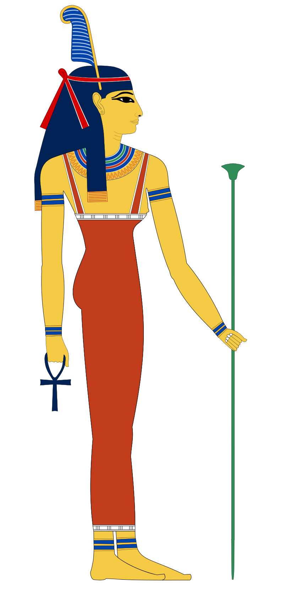

<!--
so long as their sin-filled hearts didn't outweigh an ostrich's feather 🪶

<!--

width="2000px"
style="display: block; margin: auto;"
-->

SIDE-BY-SIDE

  

    
  

  

    
long ago, in ancient egypt, no deity was more highly revered by the people + pharaohs than <b>ma'at</b>, <i>goddess of order</i> ✨ it was her who awaited them all at the end of the 42 gates to heaven where her fairness would grant them access to the after-life so long as their sin-filled hearts didn't outweigh an ostrich's feather 🪶 she was the personification of truth + justice, a role model of all the principles that mothers would teach their children to embody in order to foster a morally-rich civilization that can earn their right to live eternally 💫 it was this <i>godess of order</i> that maintained the harmon y of the rising sun god ra [god of order] from the rising from the horizon from nun, the chaotic body of water from which ra rises ~ she was the restorer of balance in the fight of chaos [isfret] 

  

  

    
<b>tidying up</b>, <i>as defined by <b>chatgpt</b> is</i>  
    <mark style="background-color: red; color: black; padding: 0px; border-radius: 0px;">the act of organizing + cleaning a space to make it neat, orderly, and free from clutter ~ this process typically involves arranging items in their designated places, getting rid of unnecessary items, and generally creating a more visually appealing and functional environment ~ tidying up can be applied to various settings, such as homes, offices, or any other spaces where organization and cleanliness are desired ~ it contributes to a sense of order, promotes efficiency, and can have positive effects on mental well-being ~</mark>

  

  

    
  

verbatim:
<mark style="background-color: red; color: black; padding: 0px; border-radius: 0px;">the act of organizing + cleaning a space to make it neat, orderly, and free from clutter. This process typically involves arranging items in their designated places, getting rid of unnecessary items, and generally creating a more visually appealing and functional environment. Tidying up can be applied to various settings, such as homes, offices, or any other spaces where organization and cleanliness are desired. It contributes to a sense of order, promotes efficiency, and can have positive effects on mental well-being.</mark>

to organize or put things in their place, in order ~

## set, god of chaos

  

    
Set (/sɛt/; Egyptological: Sutekh - swtẖ ~ stẖ[a] or Greek: Seth /sɛθ/) is a god of deserts, storms, disorder, violence, and foreigners 

  

  

    
  

all those who have departed the earthly realm, where through truth + justice,

<i>goddess of truth, balance, and <b>order</b></i>

> **order** ~  
> ~ organization via systematic arrangement of items in relation to one another  
~ grouping items based on a particular sequence, pattern, or attributes  
~ shifts a system's entropic state further from chaos and randomness  


*order* ~  
~ organization via systematic arrangement of items in relation to one another  
~ grouping items based on a particular sequence, pattern, or attributes  
~ shifts a system's entropic state further from chaos + randomness  



*order* ~  
~ organization via systematic arrangement of items in relation to one another  
~ grouping items based on a particular sequence, pattern, or attributes  
~ shifts a system's entropic state further from chaos + randomness  


## ma'at

Ma'at was the goddess who personified the concepts of truth, justice, harmony, law, morality, balance, and most importantly - order. In paintings, she was depicted as a woman who is either sitting or standing with an ostrich feather on her head and, in some cases, she was depicted with wings

   

-->

<!--
unused assets ~

-->

<!--
scrapped passages

~ provides a comprehensive overview, attains clarity in understanding, adds efficiency to processes, and increases predictability of outcomes

the arrangement or disposition of people or things in relation to each other according to a particular sequence, pattern, or method.

Organization or System: Order can describe a state of organization or a systematic arrangement, often implying a lack of chaos or randomness.


order ~  
~ organization via systematic arrangement of items in relation to one another  
~ grouping items based on a particular sequence, pattern, or attributes  
~ shifts a system's entropic state further from chaos and randomness  


-->
