### iphone zoom options

    

        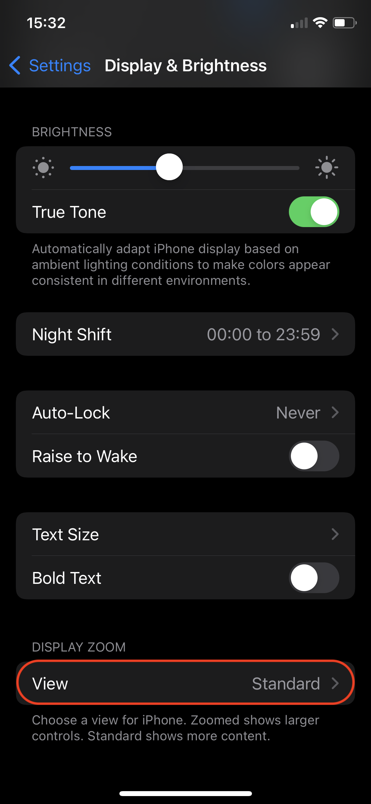
    

    

        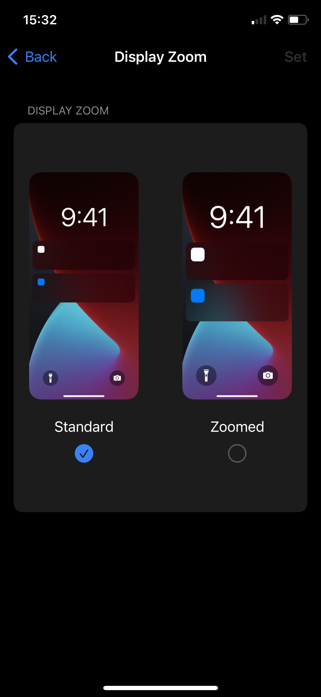
    

    

        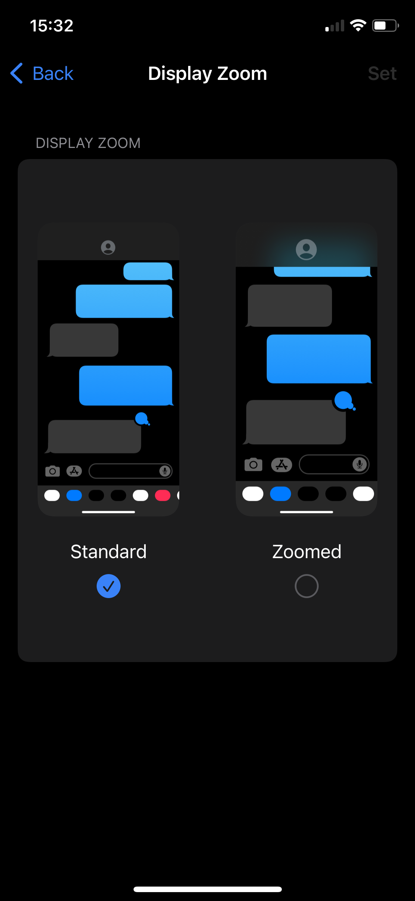
    

    

        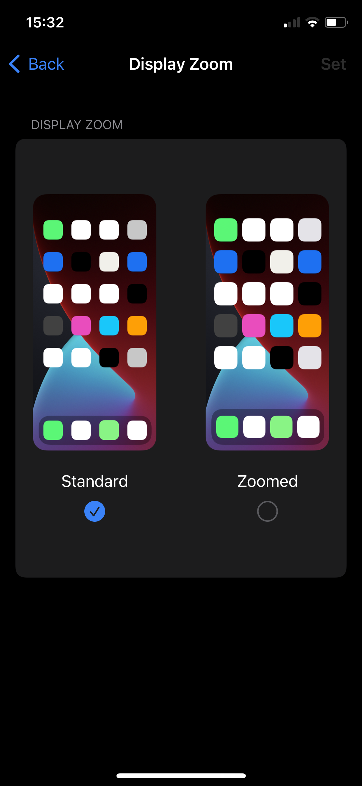
    



 <i> i apologe for the improper presentation here  🙏🏽 this should have been a simple image-slider/carousel so that you can clickly flick through the zoomed-in + zoomed-out views but i just spent hours tinkering the html, css + javascript code w/ <b><i>claude.ai</i></b> but to no avail ~ i will place a marker here + return later to switch it to a carousel when time + knowledge permit </i>



### blocks of text

    

        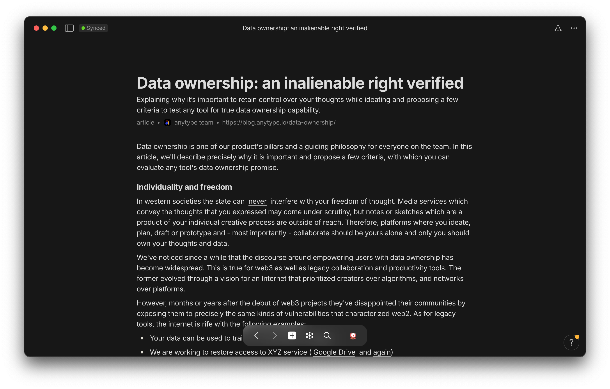
    

    

        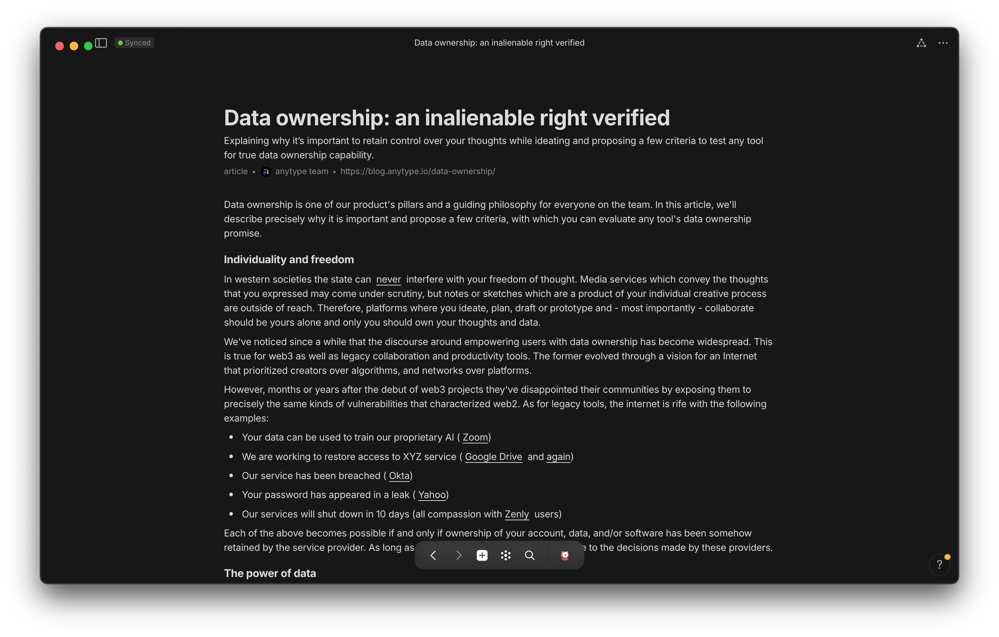
    

### serial top

    

        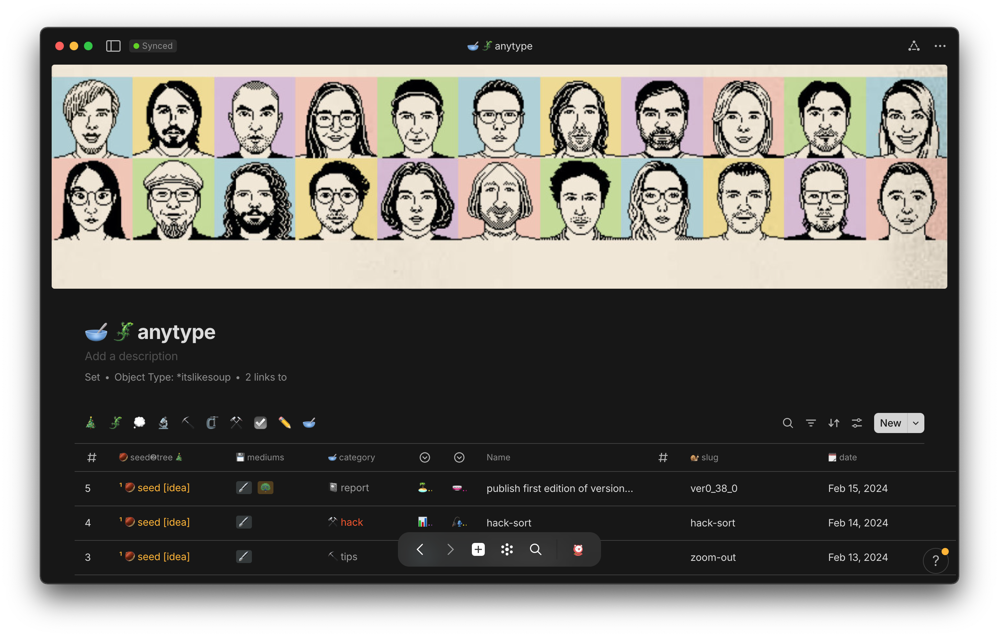
    

    

        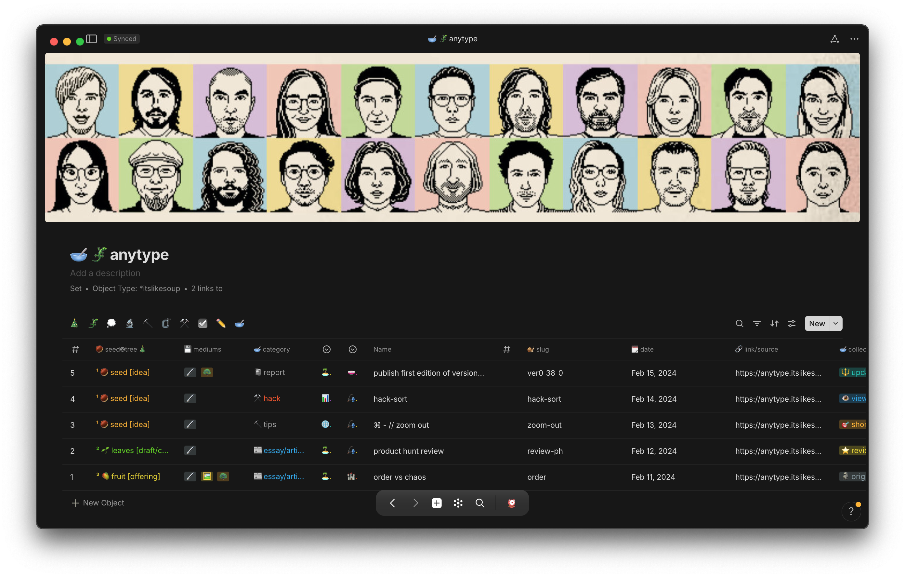
    

### set top

    

        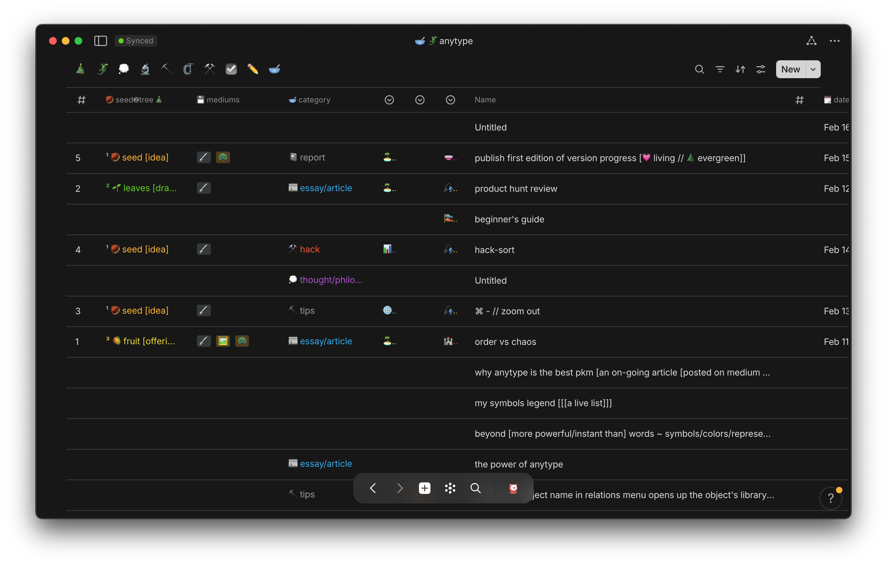
    

    

        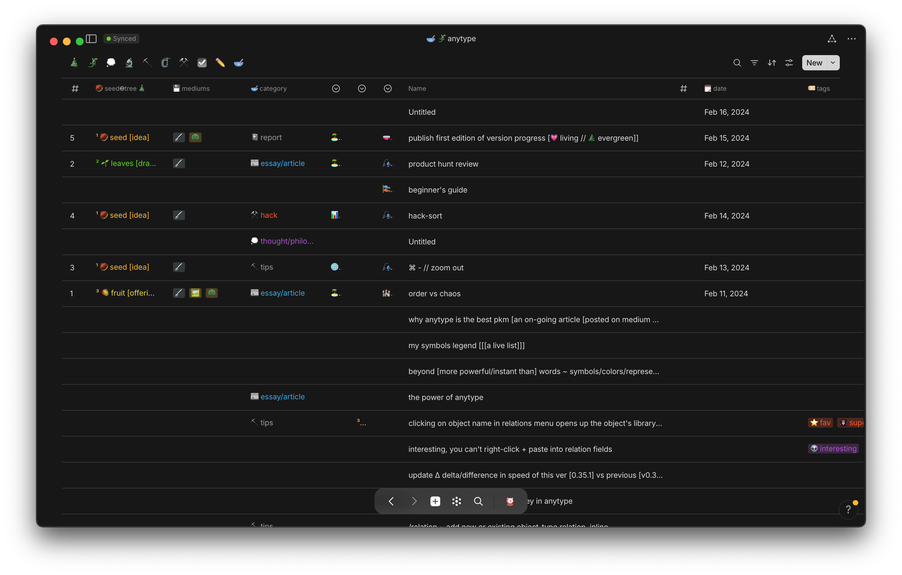
    

### side-panel

    

        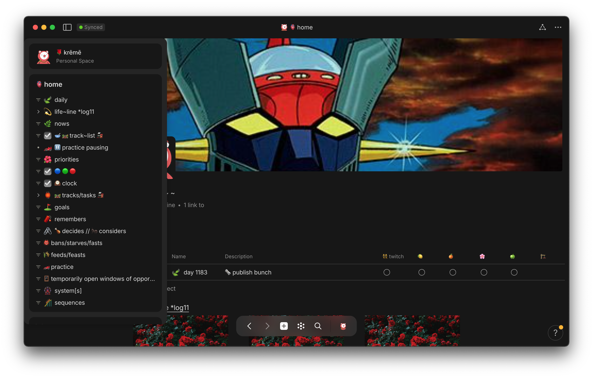
    

    

        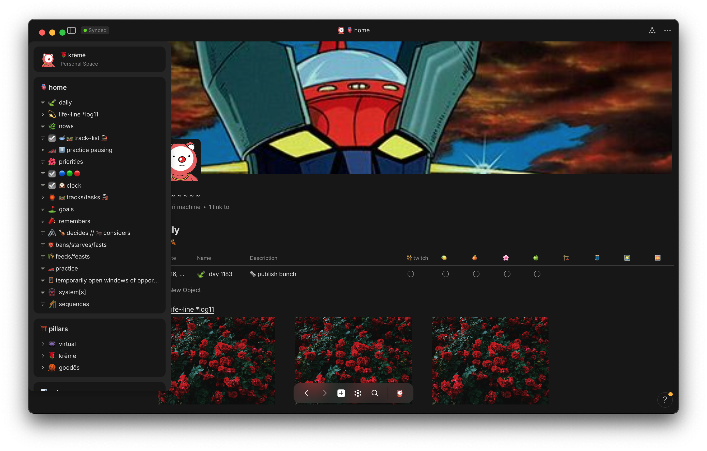
    

### homepage

    

        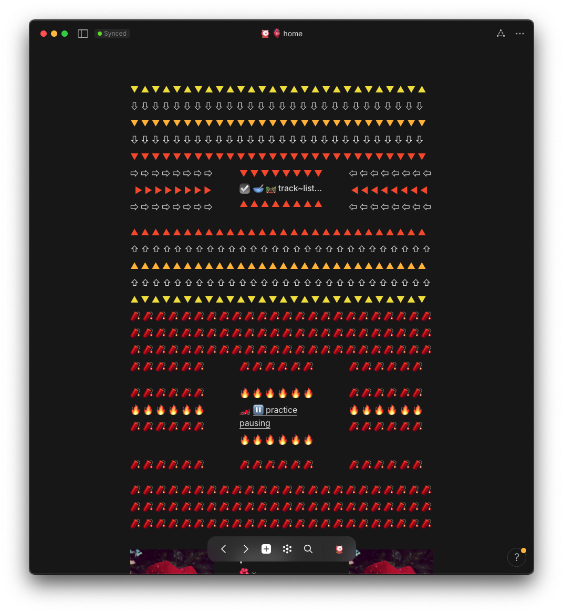
    

    

        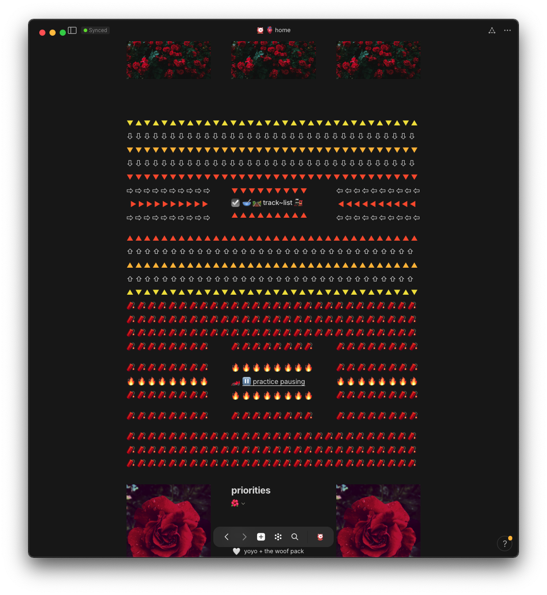
    

<!-- scraps
~ ~ ~ ~ ~ ~ ~ ~ ~ ~ ~ ~ ~ ~ ~ ~ ~ ~ ~ ~ ~ ~ ~ ~ ~ ~ ~ ~ ~ • ~ • ~ • ~ • ~ • ~ • ~ • ~ • ~ • ~ • ~ • ~ • ~ • ~ • ~ ~ ~ ~ ~ ~ ~ ~ ~ ~ ~ ~ ~ ~ ~ ~ ~ ~ ~ ~ ~ ~ ~ ~ ~ ~ ~ ~

> 
 <i> i apologe for the poor presentation here  🙏🏽 this should have been a simple slideshow so that you can clickly flick through the zoomed-in + zoomed-out views but i just spent hours tinkering the html, css + javascript code w/ claude.ai but to no avail ~ i will place a marker here + return later to improve the presentation when time + knowledge permit </i>



 <i> i apologe for the poor presentation here  🙏🏽 this should have been a simple slideshow so that you can clickly flick through the zoomed-in + zoomed-out views but i just spent hours tinkering the html, css + javascript code w/ claude.ai but to no avail ~ i will place a marker here + return later to improve the presentation when time + knowledge permit </i>



style="display: flex;"

-->
