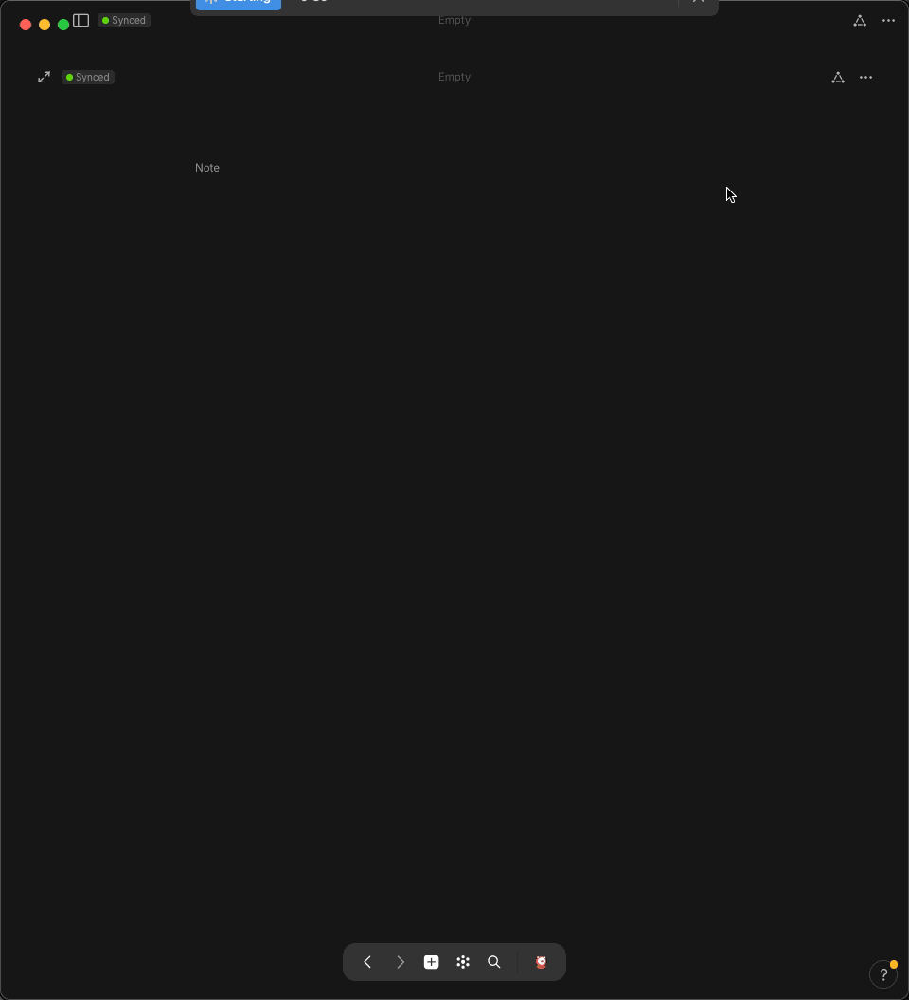
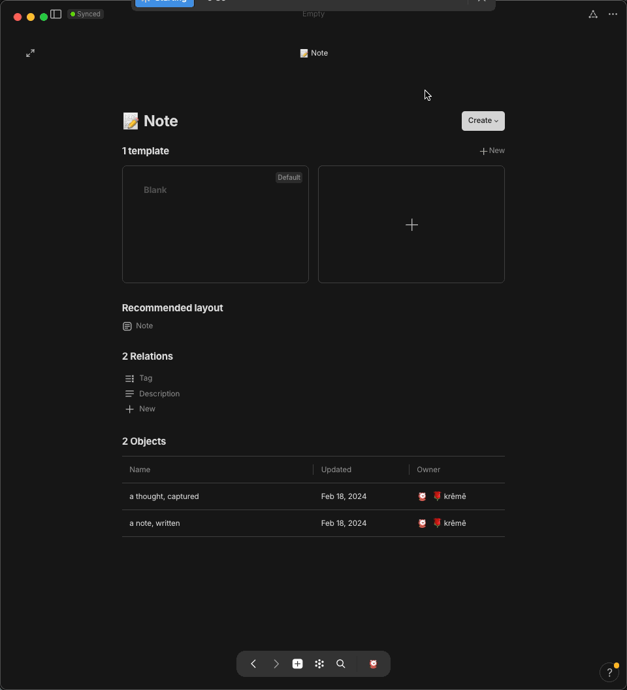
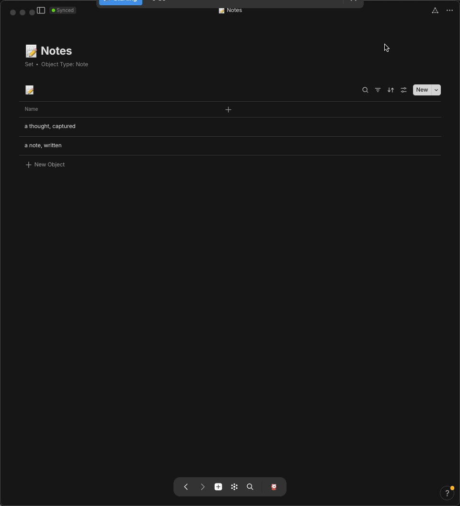
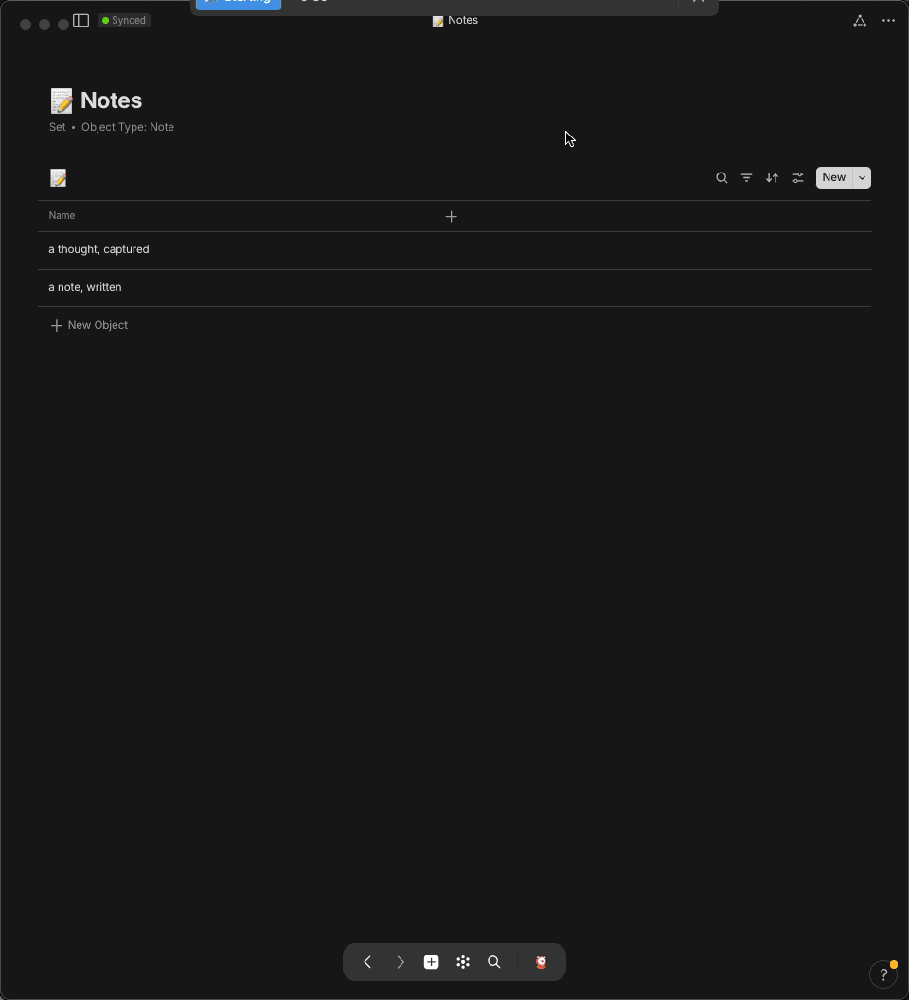
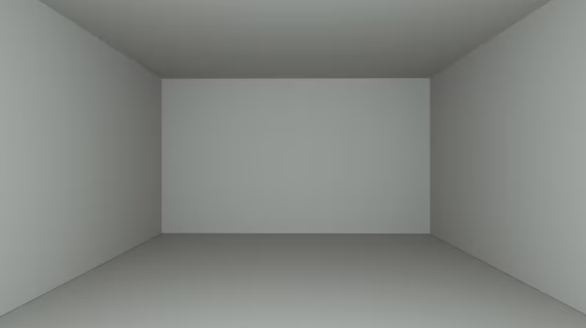
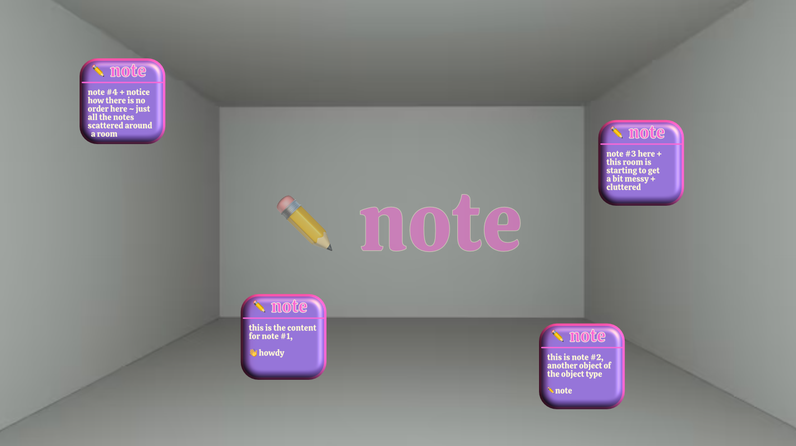

<!-- scrap
~ ~ ~ ~ ~ ~ ~ ~ ~ ~ ~ ~ ~ ~ ~ ~ ~ ~ ~ ~ ~ ~ ~ ~ ~ ~ ~ ~
~ • ~ • ~ • ~ • ~ • ~ • ~ • ~ • ~ • ~ • ~ • ~ • ~ • ~ •
~ ~ ~ ~ ~ ~ ~ ~ ~ ~ ~ ~ ~ ~ ~ ~ ~ ~ ~ ~ ~ ~ ~ ~ ~ ~ ~ ~
## create 📊 set/list for a specific ⚛️ object-type

### ~ navigate to object's library page

 to view all the notes [or <code>⚛️ objects</code>] for the default object-type <code>📝 note</code>


💠 <b style="color: red;">navigate to object-type's library page</b>  
in ⚛️ <b style="color: yellow;">object view</b> 👁

1. via the <code style="color: yellow;"> object-name identifier</code> <i style="color: yellow;">near the top-left</i>
    1. 

🐁 mouse

2. via <code style="color: yellow;">🖇 relations-pane 👁</code>
      1. 

🐁 mouse

      2. 

⌨️ keyboard <code>⌘ ⇧ r</code> == <code>open relations pane</code>

3. via <code style="color: yellow;">🏛 library-page 👁</code>
    1. 

🐁 mouse

    2. 

⌨️ keyboard <code>⌘ l</code> == <code>navigate to library page</code>



### ~ create set/list of all objects

once at the object's library page, you can now create a set [or list] of all the instances of this object [all your notes]



<i style="color: orange;">recommended</i> ~ <i>rename set list to fit a systematic naming convention, for example, refer to the following article discussing one method to name objects vs sets
</i>





<b>voila, you have now created a set , which in of itself is an object that specifically aggregates all the invididual components within that particular object [📝 Note]</b>



## add new set of object to widget // side-panel


💠 <b style="color: red;">add object to widget/side-panel</b>  

1. via the <code style="color: yellow;">menu button [ellipsis]</code> <i style="color: yellow;">near the top-right</i>
    1. 

🐁 mouse

2. via the <code style="color: yellow;">widget/side-panel </code>
    1. 

🐁 mouse




redo or maybe have image carousel... slow your ponies...


>you created a note but where did it go?

that note [an ⚛️ object] lives within/under

<ol>
  <li> within the <code style="color: yellow;">👁object-view👁</code>, navigate to the object-type's library page 🏛 ⚛️
    <ol>
      <li>

      
click on the object-type's <i>name/identifier</i> near the top-left

      image
      

      <li> open relations pane
        <ol>
          <li> 

          
mouse: click on the [relations-logo] top-right

          image
          

          <li> keyboard: <code>⌘ r</code>
        </ol>
    </ol>
</ol>


💠 <b style="color: red;">navigate to object-type's library page</b>  
⚛️ <b style="color: yellow;">object view</b> 👁

1. 🐁 mouse
    1. 

click on the object-type's <i>name/identifier</i> near the top-left

2. ⌨️ keyboard
    1. <code style="color: red;">⌘ +</code> == <code style="color: red;">zoom in</code>
    2. <code style="color: red;">⌘ -</code> == <code style="color: red;">zoom out</code>



that comprise object

## view all i nstances of an object // view all objects of an object-type

## <code>📊 set</code>/list of <code>⚛️ object</code>-type

, that display either all of your objects or all objects of a particular object-type ~

this article will guide you into creating 2 ways to view every object inside your space

instance of that object-type's

, along w/ all of it's sibling objects/notes

contents are organized by similarity ~ for instance,

the more notes you create, the more objects that fill this never-ending room, the harder it will continually get to find specific objects in the future ~ so, to prevent the eventuality of this chaotic, unorderly scenario, you must simply separate the objects + group them in bins/containers according to a trait that's shared by all the objects inside

 according to a trait that's shared by all the objects inside

try imagining every new <code>⚛️ object</code>/<code>✏️ note</code>

try imagining every new <code>⚛️ object</code> you create in <b><i>anytype</i></b> as an actual, physical object that now exists inside an empty room [<code>⚛️ object-type</code>], inside a house [<code>🌌 space</code>] ~ this room can only hold objects of a particular type, in this case, <code>✏️ notes</code> 

 just as you may put a label on each object to more easily identify them, this identity is called relations each object has properties/details/info ~

the following article will show you how to view all the objects inside a particular room, or object-type, of the house but i will now discuss if you wish to find all the objects in the house

these objects are the building blocks for your entire <b><i>anytype</i></b> database, where relations connect objects together

groupable/sortable containers them in bins/containers according to a trait that's shared by all the objects inside

to prevent the eventuality of this chaotic, unorderly future, you must simply separate/arrange the objects into groups, placing them in containers containing other objects that share similar traits ~

in the start of your <b><i>anytype</i></b> journey, you may often find yourself feeling get the sense of things being lost or unable to be found ~

## where are my notes?

in the start of your <b><i>anytype</i></b> journey, you may often get the sense of things being lost or unable to be found ~


🤷🏻‍♂️ <i>i created a note but where did it go + how can i retrieve/recall it?</i>


before knowing where your notes are, it might help to first understand <i>what</i> your notes are ~

## *what* are my notes?

like all other components, or building blocks of  <b><i>anytype</i></b>, that note you wrote is actually an <code> ⚛️ object</code>, an offspring instantiated from a parental family/type ~ so, that note lives together w/ all other sibling-objects  of the same type [<code>✏️ notes</code>, for example] within your <code>🌌 space</code> [place where <i>all objects</i>, <i>of all types</i>, are stored] ~

try imagining every new <code>⚛️ object</code> you create in <b><i>anytype</i></b> as an actual, physical object that now exists inside an empty room, inside a house ~ this room can <i>only</i> hold objects of a particular type, in this case, <code>✏️ notes</code> ~

the more notes you create, the more objects that fill this <i>never-ending</i>/<i>ever-expanding</i> room, the harder it will continually get to find specific objects in the future ~

to prevent the eventuality of such a chaotic inevitability, you must simply bring order to the system by separating the objects into into groups relating the bunch by some common, or similar traits/attributes shared by all other objects in the group

much like a birth certificate, a trait/attribute that every object is given the moment it is created is a <code>creation date</code> ~ anytype calls these bits of information that identify the nature of an object as <code>🖇 relations</code>

since every object has a <code>🖇 relations</code>/<code>📅 creation date</code>, this relation therefore units every single object inside every room [<code>⚛️ object-type</code>] in your entire house [<code>🌌 space</code>] ~

so, of all the objects in a given room, <code>✏️ notes</code>, for example, we can choose to put them into a magical container that

separate socks from tops

out of the box, there is no root directory that allows you to view/access all your objects or all objects of a particular type, but you can easily create such an assorted list, or as it's referred to in <b><i>anytype</i></b>, <code>📊 sets</code>

a set starts out as an aggregate of every single object that's an instance of it's parent's object-type ~ it's every single object
## create a set to view all objects

### sorted by creation date

### sorted by opened date

### sorted by modified date

>the next article will show how you can do the same thing but with all objects in your space, not just for a specific object-type

-->
