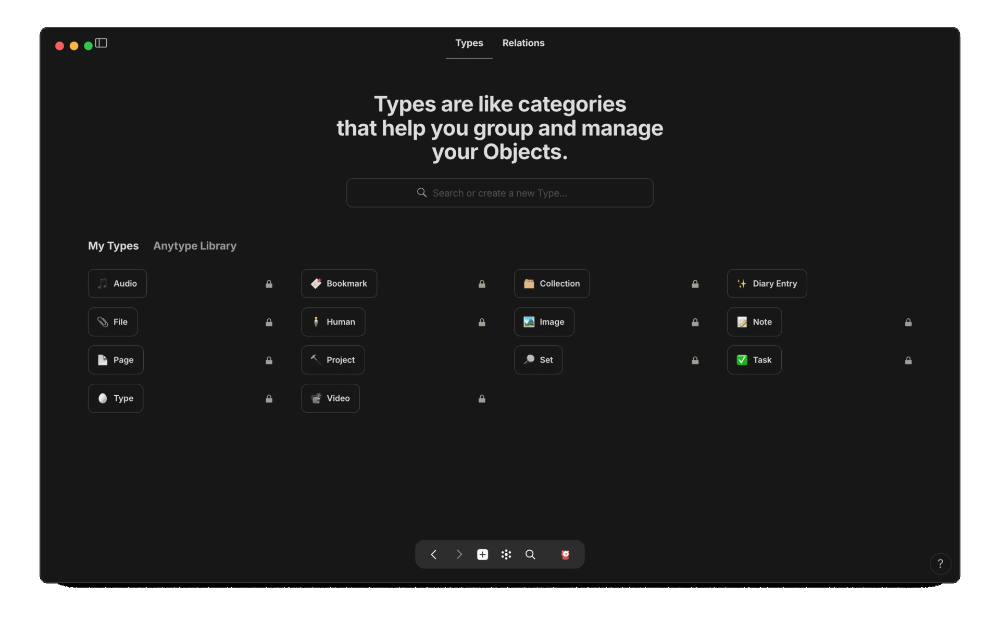
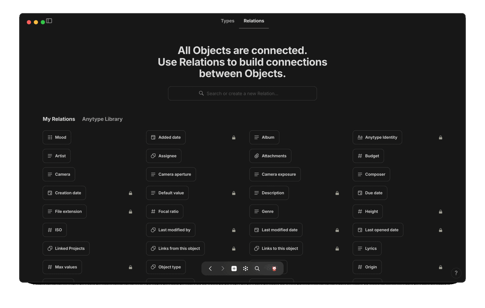
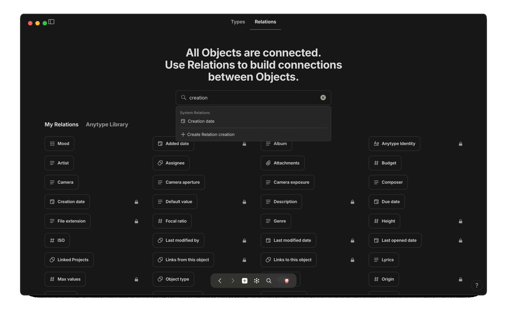
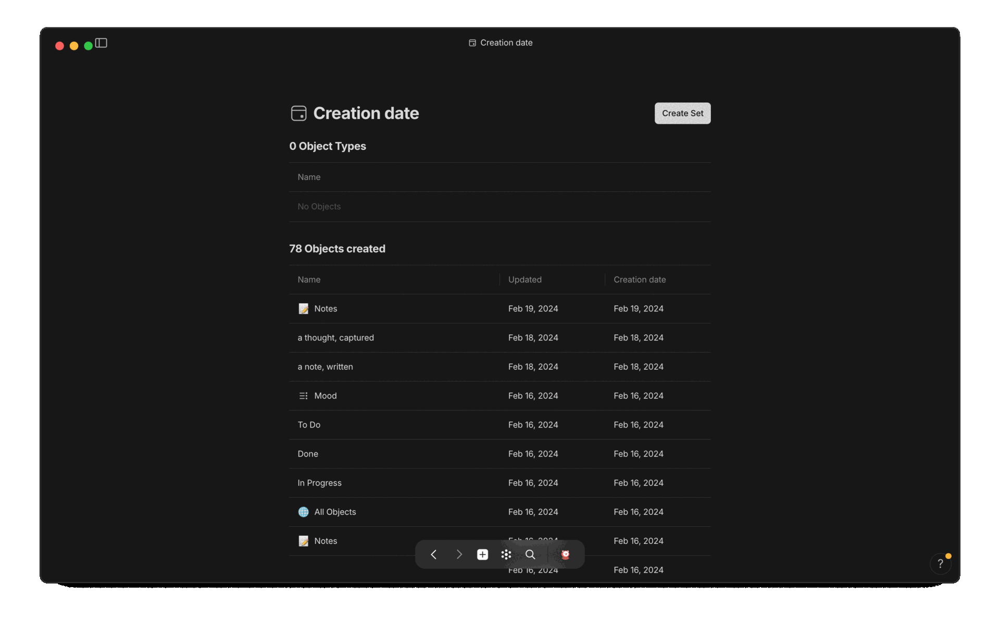
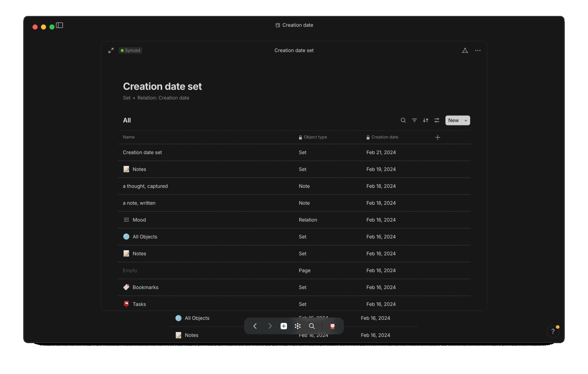
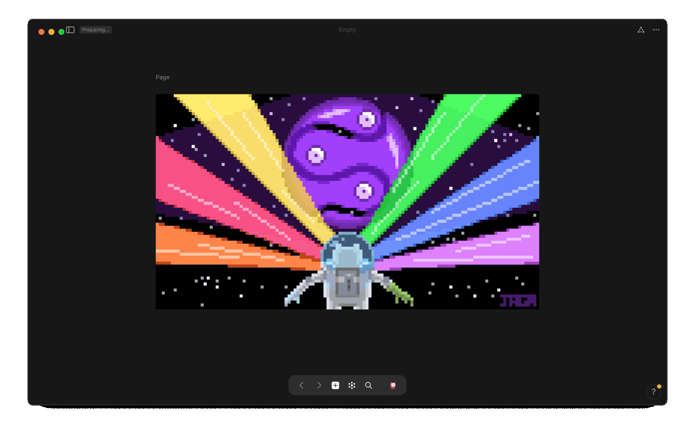

out of the box, there is no root directory that allows you to view/access all your objects <i>or all objects of a particular type</i>, but you can easily create such an aggregated list referred to in <b><i>anytype</i></b>, as a <code>📊 set</code>

## what are sets

a <code>📊 set</code> starts out as an assortment of every single object that's an offspring of its parental <code>⚛️ object-type</code> ~ so, w/out applying any filters, a freshly created <code>📊 set</code> will  contain every single sibling-object of their parent's <code>⚛️ object-type</code> ~

## what are relations

just as every person has an amalgamated identity that's comprised of many sub-identities such as name, gender [reproductively], nationality, eye-color, etc, every single object created in <b><i>anytype</i></b> also has such sub-identities, bits of information/properties relating to an object which are refered to in <b><i>anytype</i></b> as <code>🖇 relations</code>

three relations that are identifiers of every single object created in <b><i>anytype</i></b> are:
<ul>
    <li> <code>🖇 creation date</code>
    <li> <code>🖇 last opened date</code>
    <li> <code>🖇 last modified date</code>
</ul>

since these relations are shared by every single object in your <b><i>anytype</i></b> space, we can create a <code>📊 set</code> whose parent is not an <code>⚛️ object-type</code> but rather a <code>🖇 relation</code> ~ this means all sibling-objects in the set will be every single object that contains information for that relation, in our case w/ the relations above, since every object is born w/ these native-creations, every single object in our space should appear in these sets ~

### create relation sets

follow the guide below to create a set [of relations] for each of the three relations we discussed above: 

<ul>
    <li> <code>🖇 creation date</code>
    <li> <code>🖇 last opened date</code>
    <li> <code>🖇 last modified date</code>
</ul>


💠 <b style="color: red;">🧵 create 🖇 relation 📊 set</b>  
<ul>
    <ol>
        <li> navigate to library page
            <ul>
                <li> 

 via side-panel

                    <ul>
                        <li>⌨️ if configured to open/close on command
                            <ul>
                                <li> <code>⌘ .</code> // <code>⌘ \</code> == <code>open/close side-panel</code>
                            </ul>
                    </ul>
                    <ul>
                        <li>🐁 if configured to open/appear by mouse-summoning
                            <ul>
                                <li> <code>drag cursor to  left-edge of screen</code>
                            </ul>
                    </ul>
                    
                    

              <li> 

via ⌨️ keyboard

                <ul>
                    <li><code>⌘ l</code> == <code>open library page</code>
                    <li><code>⌘ ⌥ t</code> == <code>open relations panel</code>
                
                    

                </ul>
                <li> 

open relations pane

                
                

                <li> 

search for relation

                
                

                <li> 

select relation

                
                

                <li> 

click/select "create set"

                
                

                <li> 

configure title/icon [set-identity]

                
                

            </ul>
    </ol>
    <b>entire process</b>
            

</ul>


<!-- scrap
~ ~ ~ ~ ~ ~ ~ ~ ~ ~ ~ ~ ~ ~ ~ ~ ~ ~ ~ ~ ~ ~ ~ ~ ~ ~ ~ ~
~ • ~ • ~ • ~ • ~ • ~ • ~ • ~ • ~ • ~ • ~ • ~ • ~ • ~ •
~ ~ ~ ~ ~ ~ ~ ~ ~ ~ ~ ~ ~ ~ ~ ~ ~ ~ ~ ~ ~ ~ ~ ~ ~ ~ ~ ~

-->
