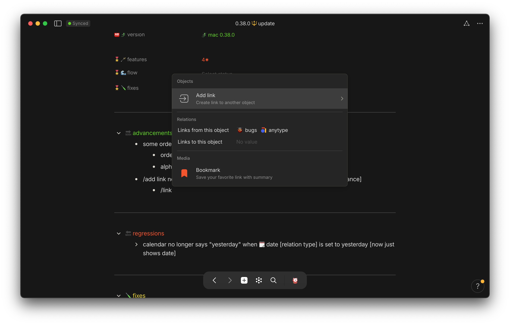

## ➡ progressions

add link now top/first option rather than last 
🌊 increased flow/reduced resistance


## ⬅ regressions

## 🪛 fixes

## 🦋 changes

<!-- scraps
~ ~ ~ ~ ~ ~ ~ ~ ~ ~ ~ ~ ~ ~ ~ ~ ~ ~ ~ ~ ~ ~ ~ ~ ~ ~ ~ ~
~ • ~ • ~ • ~ • ~ • ~ • ~ • ~ • ~ • ~ • ~ • ~ • ~ • ~ •
~ ~ ~ ~ ~ ~ ~ ~ ~ ~ ~ ~ ~ ~ ~ ~ ~ ~ ~ ~ ~ ~ ~ ~ ~ ~ ~ ~

## 
➡ progressions

helloj

summary {
    cursor: pointer;
    font-weight: bold;
    border: 1px solid #ccc;
    padding: 5px;
}

details[open] summary {
    background-color: #f0f0f0;
}

details {
  margin-top: 60px; /* Lower value */
}

- some order/pattern for ⌄ select + ≕ multi-select items

  

      
    

See Image

add link now top/first option rather than last

    
add link now top/first option rather than last <code>increased flow/reduced resistance</code>

    

<code>increased flow/reduced resistance</code>

-->
