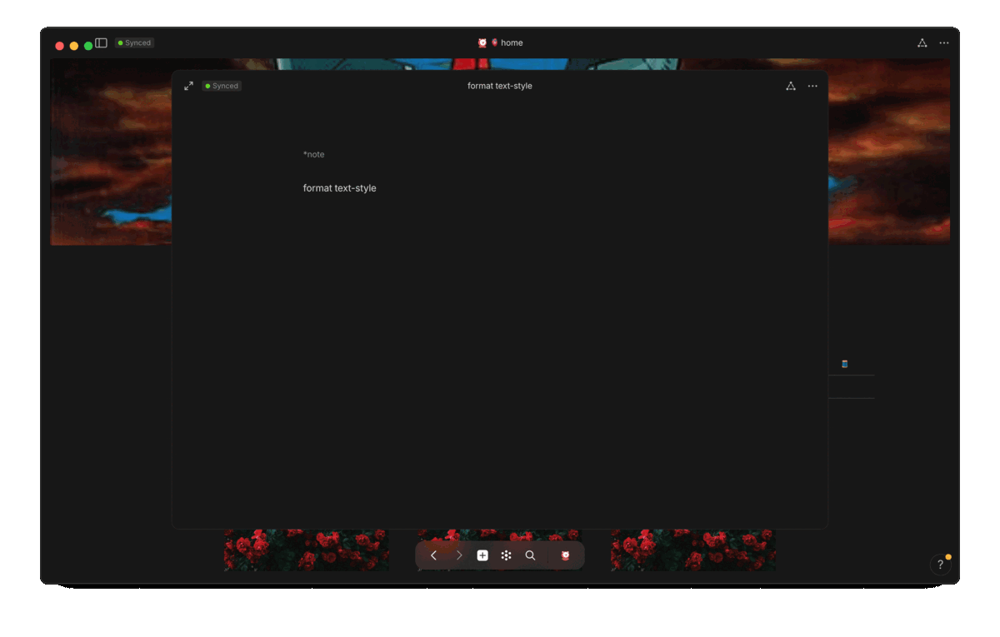
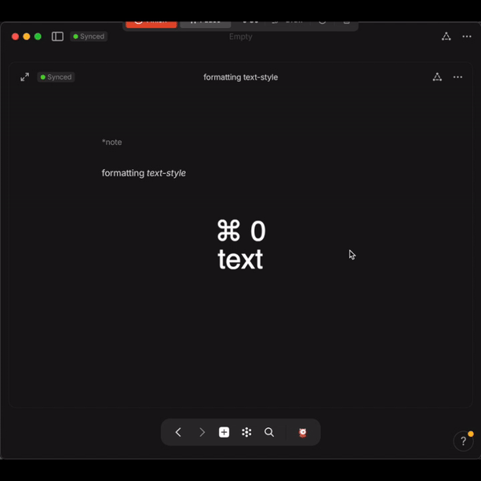
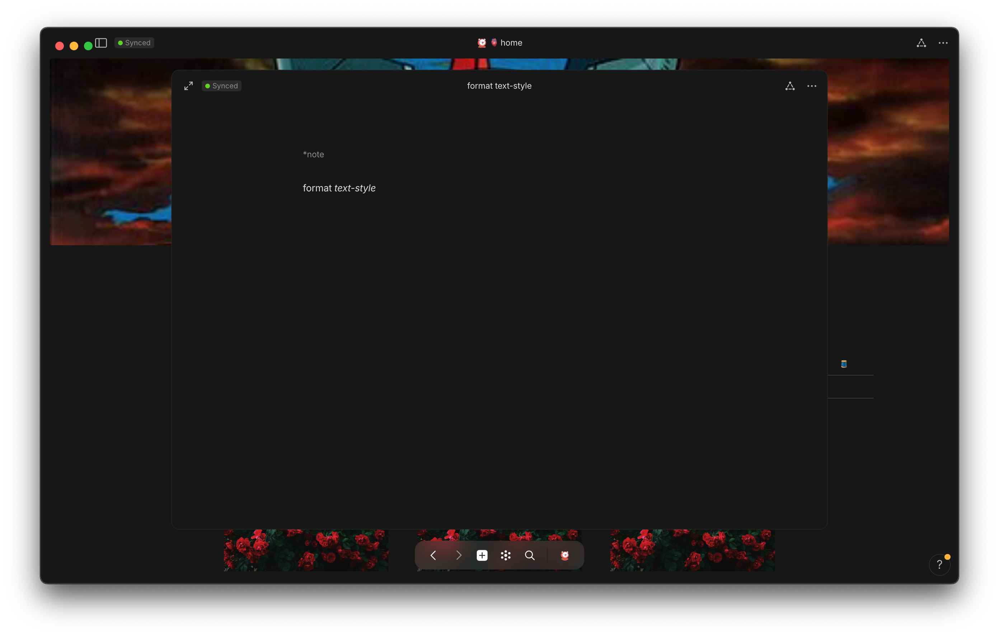
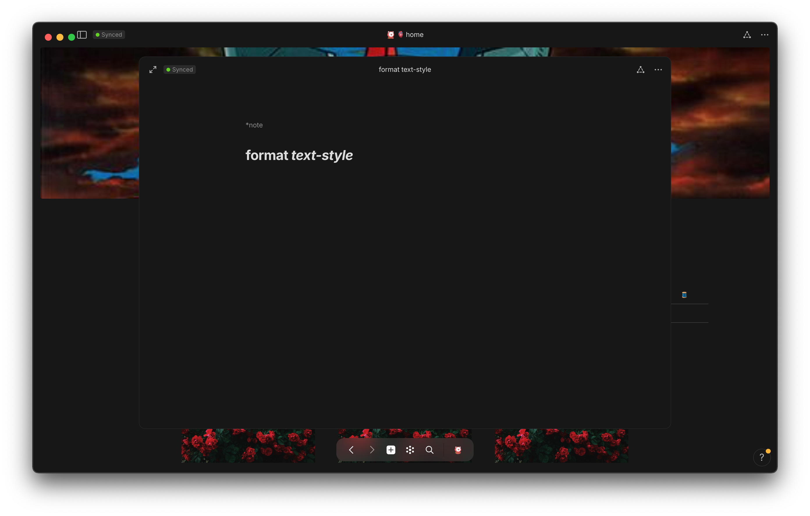
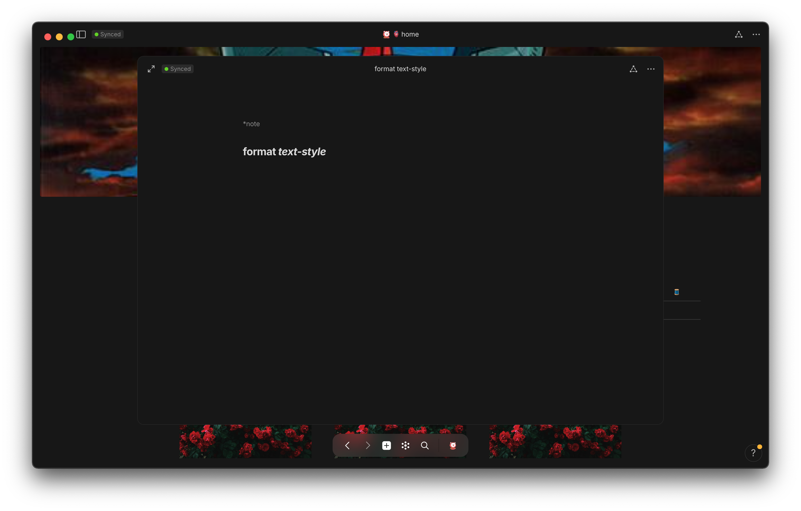
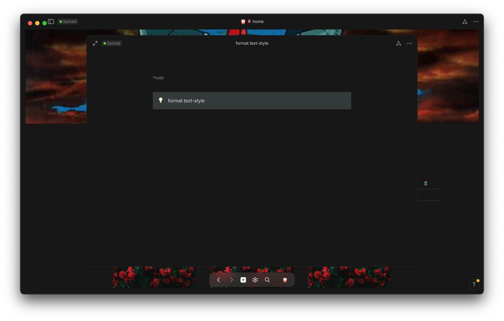
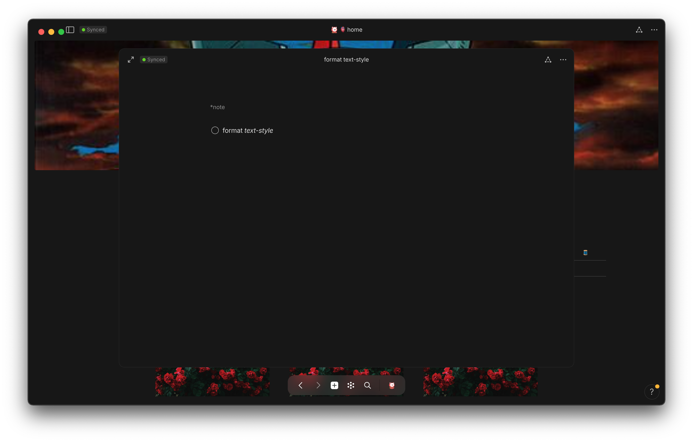

inside <view>object-view</view>, you're able to format the text inside a content-box to many different styles


💠 <b style="color: red;">format <i>text-style</i></b>  

1. 🐁 mouse
    1. 

contextual-menu
<i style="color: yellow;">highlight text to open up <code>contextual menu</code></i>

    2. 

properties-bar
<i style="color: yellow;">click on the <code>properties bar</code> to the left of the content-box</i>

2. ⌨️ keyboard
    1. 

<code>⌘ 0-9</code>

    2. 

<code>⌘ 0</code> == <code>text</code>

    3. 

<code>⌘ 1</code> == <code>title [h1]</code>

    4. 

<code>⌘ 2</code> == <code>header [h2]</code>

    5. 

<code>⌘ 3</code> == <code>subheader [h3]</code>

    6. 

<code>⌘ 4</code> == <code>highlighted</code>

    7. 

<code>⌘ 5</code> == <code>callout</code>

    8. 

<code>⌘ 6</code> == <code>checkbox</code>

    9. 

<code>⌘ 7</code> == <code>bulleted list</code>

    10. 

<code>⌘ 8</code> == <code>numbered list</code>

    11. 

<code>⌘ 9</code> == <code>toggle</code>




replace png images w/ tiny jpg


<!-- scraps
~ ~ ~ ~ ~ ~ ~ ~ ~ ~ ~ ~ ~ ~ ~ ~ ~ ~ ~ ~ ~ ~ ~ ~ ~ ~ ~ ~
~ • ~ • ~ • ~ • ~ • ~ • ~ • ~ • ~ • ~ • ~ • ~ • ~ • ~ •
~ ~ ~ ~ ~ ~ ~ ~ ~ ~ ~ ~ ~ ~ ~ ~ ~ ~ ~ ~ ~ ~ ~ ~ ~ ~ ~ ~

-->
