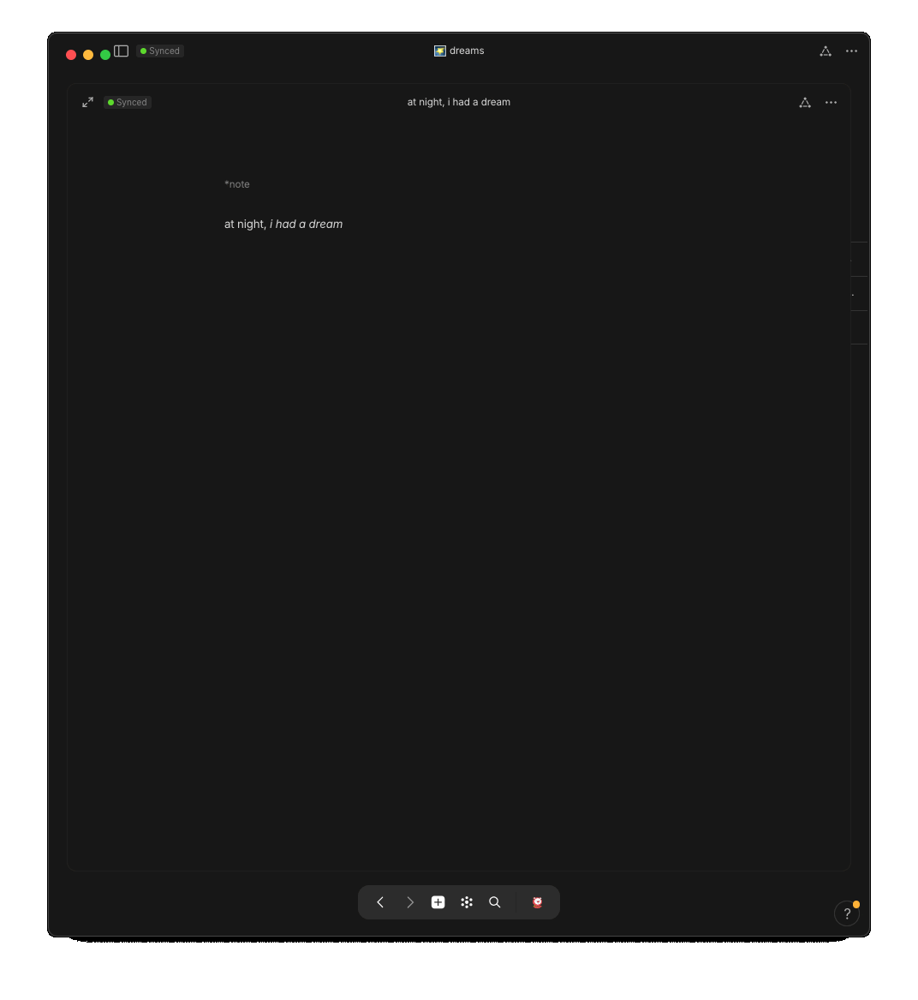

## intro ~ lucid dreaming

a lucid dream is when one gains awareness that they are dreaming ~ in that <i>instant</i>, they are transformed into their very own genie where what they wish, <i>instantly</i> becomes so 🧞‍♂️ how our mind perceives the reality of our dream-world is nearly identical to how it perceives our waking-life <i style="color: #868686;">~ both realities are practically indistinguishable to our senses ~ </i> just as we wish to <i>live the life of our dreams</i>, we can actually <i>live</i> a life in our dreams ~

you often hear that we spend, or what's actually implied, <i style="color: #868686;">waste</i>, a third of our life sleeping ~ instead, if that time can be seen as an extension of life, another realm of living, one where time doesn't quite exist as linearly as it does in this fleshy-world, then that third of time becomes practically infinite time to live endless lives ~

the key to gaining access to that lucid world at night is again, to simply gain-awareness that you are dreaming ~ a trick to get you to that realization is to first remember your dreams + a trick to remembering your dreams is to journal them right as you wake up ~

as i've learned in life, if something isn't easy, you likely won't do it ~ so, unless you have a truly seamless system to journal the moment you awake while the dream is still freshest in your mind, the sparced instances of journalling won't ever materialize into a solidified habit ~ the process must be completely free of any <i>daunts</i> or resistence

a bed-side notebook + pen could make for a pleasant system if you enjoy physically writing, but unless they're put in arm's reach before you go to sleep or you don't have a bed-side light-source to you see the pages if you wake while it's still dark, you likely won't uphold the routine to turn this action into habit ~

## a seamless [capturing] system

unless you choose to consciously create a mental separation from your phone at night, since your phone is often in arm's reach at night + no additional light is needed to write, quickly unlocking your phone w/ one eye open, hard-pressing the <b><i>anytype</i></b> app-logo, tapping <i>create note</i>, and 2 seconds later, you have a blank black page to jot down all that you remember

>you can also create a voice-recording for faster capturing of thoughts/memories that you can then later be transcribed

once captured, free from distractions, in your default object-type, you can now change the object-type to <code>🌠 dream</code>

## ⚛️ object 🌠 dream journal


💠 <b style="color: red;">change [object-]type</b>  
<ul>
    <ul>
        <li> from <code>👁 object-view</code>
        
    </ul>
</ul>



## 🖇 relations


continue/bump/update/expand/build-upon ~•~ soon ~•~


☑️ notify me of update


^ ^ ^ ^ build it ^ ^ ^ ^


<!-- scraps
~ ~ ~ ~ ~ ~ ~ ~ ~ ~ ~ ~ ~ ~ ~ ~ ~ ~ ~ ~ ~ ~ ~ ~ ~ ~ ~ ~
~ • ~ • ~ • ~ • ~ • ~ • ~ • ~ • ~ • ~ • ~ • ~ • ~ • ~ •
~ ~ ~ ~ ~ ~ ~ ~ ~ ~ ~ ~ ~ ~ ~ ~ ~ ~ ~ ~ ~ ~ ~ ~ ~ ~ ~ ~

-->
