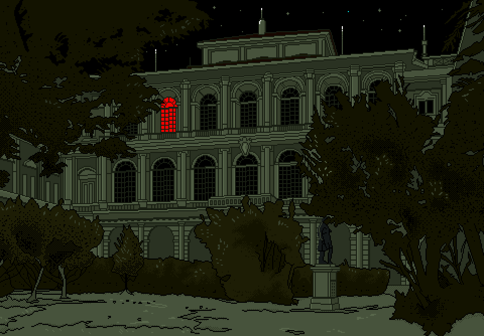
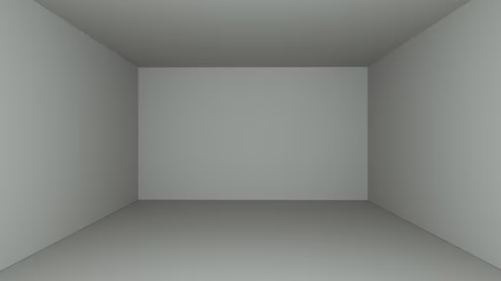
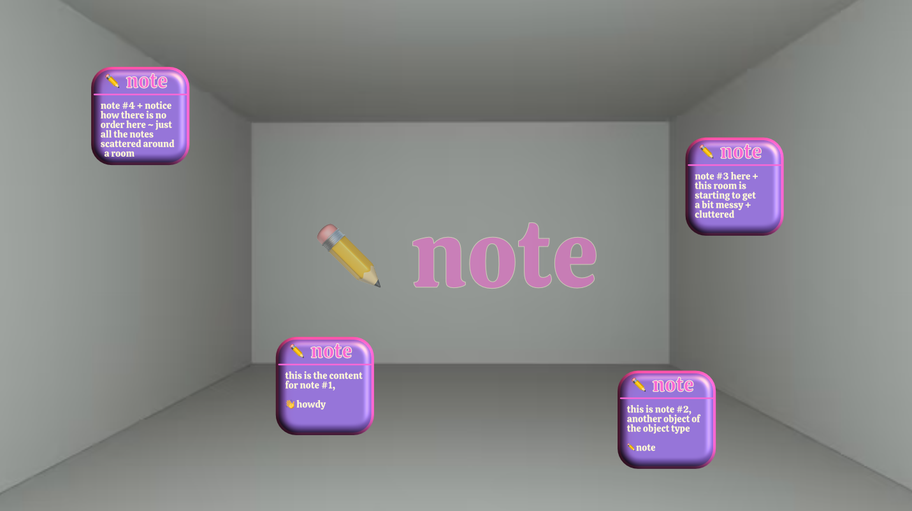

## where are my notes?

in the start of your <b><i>anytype</i></b> journey, you may often get the sense of things being lost or unable to be found ~


🤷🏻‍♂️ <i>i created a note but where did it go + how can i retrieve/recall it?</i>


before knowing where your notes are, it might help to first understand <i>what</i> your notes are ~

## *what* are my notes?

like all other components, or building blocks of  <b><i>anytype</i></b>, that note you wrote is actually an <code> ⚛️ object</code>, an offspring instantiated from a parental family/type ~ so, that note lives together w/ all other sibling-objects  of the same type [<code>✏️ notes</code>, for example] within your <code>🌌 space</code> [place where <i>all objects</i>, <i>of all types</i>, are stored] ~

<!--

-->

try imagining every new <code>⚛️ object</code> you create in <b><i>anytype</i></b> as an actual, physical object that now exists inside an empty room, inside a house ~ this room can <i>only</i> hold objects of a particular type, in this case, <code>✏️ notes</code> ~

the more notes you create, the more objects that fill this <i>never-ending</i>/<i>ever-expanding</i> room, the harder it will continually get to find specific objects in the future ~

<!-- scraps
~ ~ ~ ~ ~ ~ ~ ~ ~ ~ ~ ~ ~ ~ ~ ~ ~ ~ ~ ~ ~ ~ ~ ~ ~ ~ ~ ~
~ • ~ • ~ • ~ • ~ • ~ • ~ • ~ • ~ • ~ • ~ • ~ • ~ • ~ •
~ ~ ~ ~ ~ ~ ~ ~ ~ ~ ~ ~ ~ ~ ~ ~ ~ ~ ~ ~ ~ ~ ~ ~ ~ ~ ~ ~

to prevent the eventuality of such a chaotic inevitability, you must simply bring order to the system by separating the objects into into groups relating the bunch by some common, or similar traits/attributes shared by all other objects in the group

much like a birth certificate, a trait/attribute that every object is given the moment it is created is a <code>creation date</code> ~ anytype calls these bits of information that identify the nature of an object as <code>🖇 relations</code>

since every object has a <code>🖇 relations</code>/<code>📅 creation date</code>, this relation therefore units every single object inside every room [<code>⚛️ object-type</code>] in your entire house [<code>🌌 space</code>] ~

so, of all the objects in a given room, <code>✏️ notes</code>, for example, we can choose to put them into a magical container that

separate socks from tops

out of the box, there is no root directory that allows you to view/access all your objects or all objects of a particular type, but you can easily create such an assorted list, or as it's referred to in <b><i>anytype</i></b>, <code>📊 sets</code>

a set starts out as an aggregate of every single object that's an instance of it's parent's object-type ~ it's every single object
## create a set to view all objects

### sorted by creation date

### sorted by opened date

### sorted by modified date

>the next article will show how you can do the same thing but with all objects in your space, not just for a specific object-type

-->
