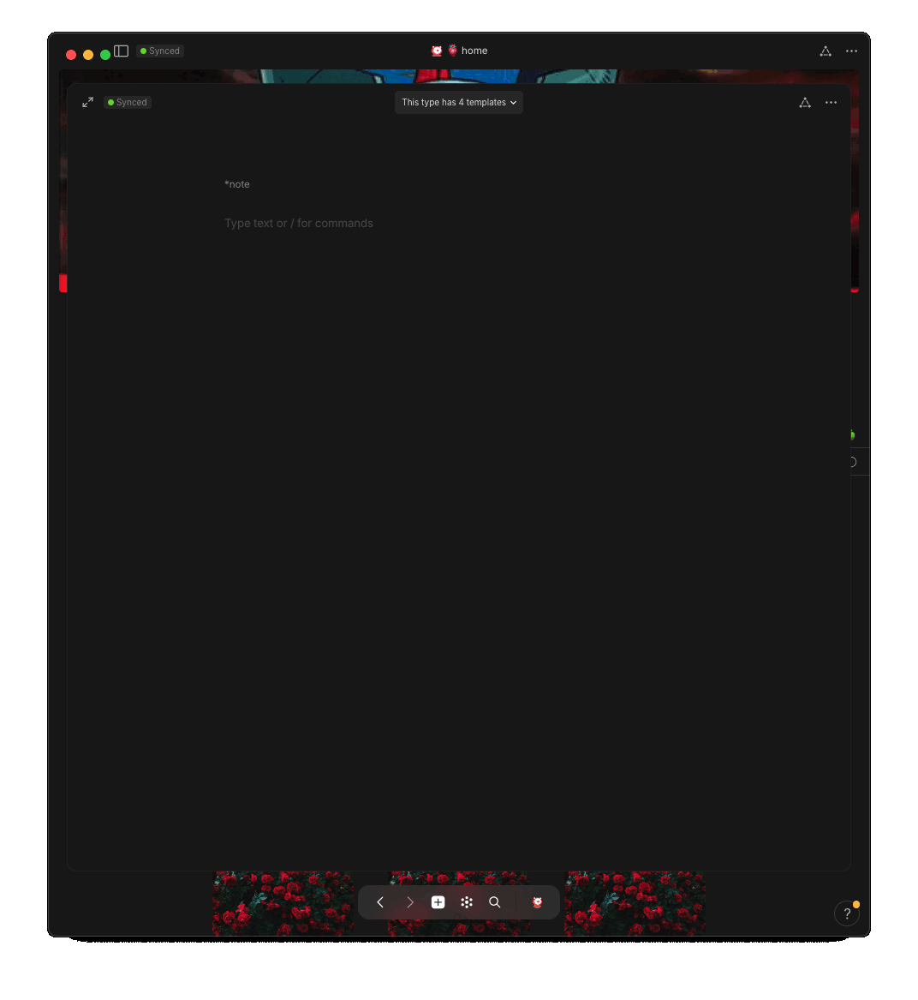


🗜 <b style="color: yellow;">hyperlink paste</b>  
<i style="color: orange;">once hyperlink is copied to clipboard</i>
<ol>
    <li> highlight text you wish to <u style="color: blue;">hyperlink</u>
    <li> 

paste copied link

        <ul>
            <li>

⌨️ keyboard

                <ul>
                    <li><code>⌘ v</code> == <code>paste</code>
                </ul>
                    

            <li>

🐁 mouse

                <ul>
                    <li> <code>right-click</code>
                    <li> click/select  <code>paste</code>
                </ul>
        </ul>
        

    
</ol>



<!-- scraps
~ ~ ~ ~ ~ ~ ~ ~ ~ ~ ~ ~ ~ ~ ~ ~ ~ ~ ~ ~ ~ ~ ~ ~ ~ ~ ~ ~
~ • ~ • ~ • ~ • ~ • ~ • ~ • ~ • ~ • ~ • ~ • ~ • ~ • ~ •
~ ~ ~ ~ ~ ~ ~ ~ ~ ~ ~ ~ ~ ~ ~ ~ ~ ~ ~ ~ ~ ~ ~ ~ ~ ~ ~ ~

-->
