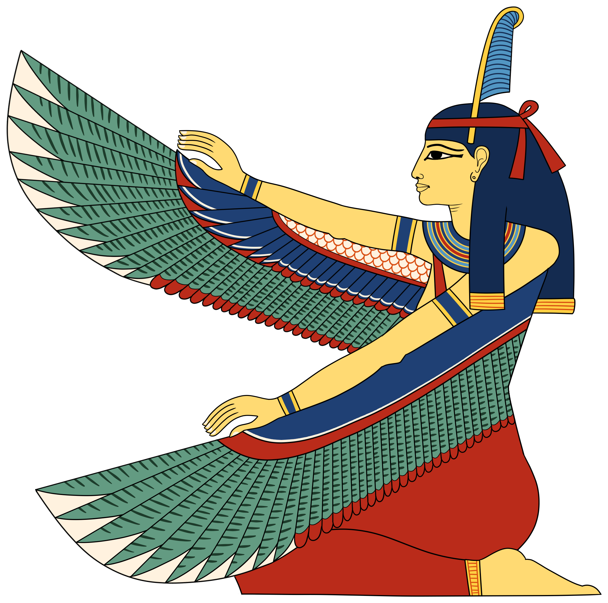

## ma'at
Ma'at was the goddess of truth, justice, balance, and most importantly - order. In paintings, she was depicted as a woman who is either sitting or standing with an ostrich feather on her head and, in some cases, she was depicted with wings.

<!--  -->

  

    
This is the first block of text.

  

  

    
This is the second block of text.

  

## set
